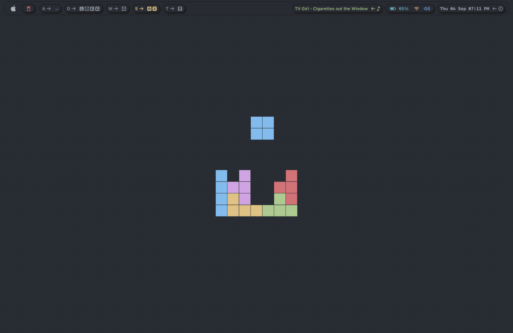

# Dotfiles

## 🍚 Previous Rices

- [GNOME Minimalist Nord](https://github.com/Antonious-Awad/dotfiles/tree/d4a20b4946fda98937234c7b71c07bec45b0e93c)

## 📸 Preview



## 🛠️ Installation

### 📋 Prerequisites

#### Homebrew

```bash
/bin/bash -c "$(curl -fsSL https://raw.githubusercontent.com/Homebrew/install/HEAD/install.sh)"
```

#### Git & Stow

```bash
brew install git stow
```

### Setup

**1. Clone**

```bash
cd ~ && git clone git@github.com:Antonious-Awad/dotfiles.git
cd dotfiles
```

**2. Symlink**

```bash
stow .
```

- you can edit `.stowrc` to specify the target directory
