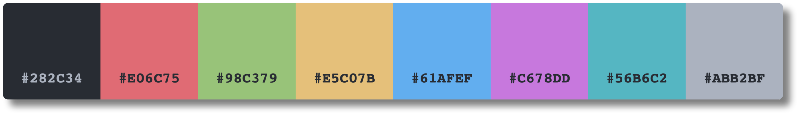

# One Dark Pro Darker - Color Palette Reference

## Palette Reference



## Primary Colors

| Purpose                  | Hex Code  | Description                    | Preview                                                                                                                  |
| ------------------------ | --------- | ------------------------------ | ------------------------------------------------------------------------------------------------------------------------ |
| **Background**           | `#282c34` | Main background                | <div style="width: 20px; height: 20px; background-color: #282c34; border: 1px solid #cad3f5; border-radius: 4px;"></div> |
| **Background (Darker)**  | `#23272e` | Main darker background         | <div style="width: 20px; height: 20px; background-color: #23272e; border: 1px solid #cad3f5; border-radius: 4px;"></div> |
| **Background (Darkest)** | `#1e2228` | Main darkest background        | <div style="width: 20px; height: 20px; background-color: #1e2228; border: 1px solid #cad3f5; border-radius: 4px;"></div> |
| **Secondary Background** | `#24273a` | Cards, panels, secondary areas | <div style="width: 20px; height: 20px; background-color: #24273a; border: 1px solid #cad3f5; border-radius: 4px;"></div> |
| **Text Primary**         | `#abb2bf` | Main text color                | <div style="width: 20px; height: 20px; background-color: #abb2bf; border: 1px solid #cad3f5; border-radius: 4px;"></div> |
| **Accent Primary**       | `#61afef` | Main accent color              | <div style="width: 20px; height: 20px; background-color: #61afef; border: 1px solid #cad3f5; border-radius: 4px;"></div> |

## Accent Colors (Identity/Container Colors)

| Color         | Hex Code  | Preview                                                                                                                  |
| ------------- | --------- | ------------------------------------------------------------------------------------------------------------------------ |
| **Blue**      | `#61afef` | <div style="width: 20px; height: 20px; background-color: #61afef; border: 1px solid #cad3f5; border-radius: 4px;"></div> |
| **Turquoise** | `#56b6c2` | <div style="width: 20px; height: 20px; background-color: #56b6c2; border: 1px solid #cad3f5; border-radius: 4px;"></div> |
| **Green**     | `#98c379` | <div style="width: 20px; height: 20px; background-color: #98c379; border: 1px solid #cad3f5; border-radius: 4px;"></div> |
| **Yellow**    | `#e5c07b` | <div style="width: 20px; height: 20px; background-color: #e5c07b; border: 1px solid #cad3f5; border-radius: 4px;"></div> |
| **Red**       | `#e06c75` | <div style="width: 20px; height: 20px; background-color: #e06c75; border: 1px solid #cad3f5; border-radius: 4px;"></div> |
| **Purple**    | `#c678dd` | <div style="width: 20px; height: 20px; background-color: #c678dd; border: 1px solid #cad3f5; border-radius: 4px;"></div> |

## Hover/Interaction States

| State             | Color                | Description                     |
| ----------------- | -------------------- | ------------------------------- |
| **Accent Hover**  | `rgb(213, 184, 248)` | Lighter purple for hover states |
| **Accent Active** | `rgb(220, 160, 246)` | Active state purple             |
| **Button Hover**  | `rgb(84, 89, 116)`   | Darker button hover state       |

## Usage Hierarchy

1. `#282C34` - Darkest backgrounds (main content, sidebars, toolbars)
2. `#24273A` - Secondary backgrounds (cards, panels, URL bar)
3. `#363A4F` - Interactive elements (buttons, hover states)
4. `#ABB2BF` - Text and icons
5. `#61AFEF` - Accent color (links, primary actions, borders)

## Color Swatches

### Main Theme Colors

| Color                | Hex       | Preview                                                                                                                  |
| -------------------- | --------- | ------------------------------------------------------------------------------------------------------------------------ |
| Primary Background   | `#282C34` | <div style="width: 20px; height: 20px; background-color: #282c34; border: 1px solid #cad3f5; border-radius: 4px;"></div> |
| Secondary Background | `#24273A` | <div style="width: 20px; height: 20px; background-color: #24273a; border: 1px solid #cad3f5; border-radius: 4px;"></div> |
| Tertiary Background  | `#363A4F` | <div style="width: 20px; height: 20px; background-color: #363a4f; border: 1px solid #cad3f5; border-radius: 4px;"></div> |
| Text Primary         | `#ABB2BF` | <div style="width: 20px; height: 20px; background-color: #abb2bf; border: 1px solid #cad3f5; border-radius: 4px;"></div> |
| Accent Primary       | `#61AFEF` | <div style="width: 20px; height: 20px; background-color: #61afef; border: 1px solid #cad3f5; border-radius: 4px;"></div> |
| Accent Hover         | `#e5c07b` | <div style="width: 20px; height: 20px; background-color: #e5c07b; border: 1px solid #cad3f5; border-radius: 4px;"></div> |

## CSS Custom Properties Reference

For easy copy-paste into your own projects:

```css
:root {
  /* Primary Colors */
  --bg-primary: #23272e;
  --bg-secondary: #24273a;
  --bg-tertiary: #363a4f;
  --text-primary: #abb2bf;
  --accent-primary: #61afef;

  /* Accent Colors */
  --color-blue: #61afef;
  --color-turquoise: #56b6c2;
  --color-green: #98c379;
  --color-yellow: #e5c07b;
  --color-red: #e06c75;
  --color-purple: #c678dd;
}
```
